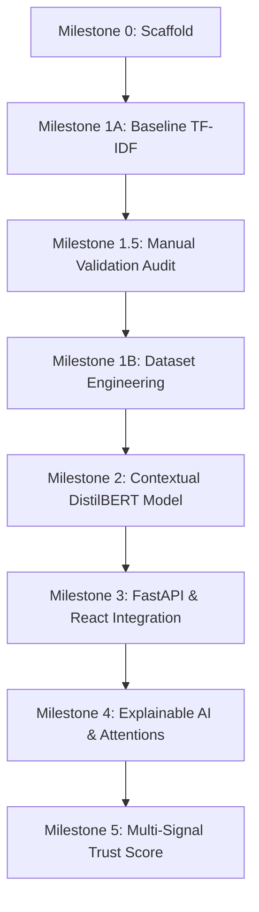

# VeriNews AI 🔍

> **An Explainable AI Platform for News Trust Assessment** — A research-driven machine learning engineering project designed to estimate and explain the trustworthiness of news articles. Features a FastAPI backend and a React + Vite frontend.


---

## 📖 The Engineering & Research Story

### 1. Motivation
The proliferation of digital misinformation requires robust detection tools. However, commercial fake news detectors often act as "black boxes" that declare news objectively "true" or "false". VeriNews AI is built on the philosophy that **AI cannot determine absolute truth**. Instead, our platform aims to provide a multi-signal **Trust Assessment** by combining natural language processing, validation, explainable AI (XAI), and source credibility.

### 2. Why Benchmark Accuracy Alone is Misleading
In machine learning research, models are routinely evaluated on standard test splits of benchmark datasets. While this measures performance on the specific distribution of the training data, it is a poor indicator of real-world generalization. Benchmark datasets are often plagued by structural biases, temporal shifts, and publication-specific patterns.

### 3. Why a Baseline Model was Intentionally Built First
We intentionally chose a simple bag-of-words baseline (**TF-IDF features + Logistic Regression**) for our first milestone. Rather than building the most complex neural network immediately, we established a reproducible baseline with low computational overhead to map the baseline performance floor.

### 4. Manual Validation Methodology
To audit our model's real-world reliability, we curated a manual validation dataset of **60 articles** across **14 distinct categories** (including Space, Health, Technology, Sports, Local News, Conspiracy Theories, and Clickbait). These articles represent modern, out-of-domain articles that the model had never seen.

### 5. Discovery of Dataset Bias
Although our baseline achieved **97.59% accuracy** on the benchmark test split, independent manual validation yielded only **45.0% accuracy**. 

Diagnostic feature analysis revealed severe **publisher leakage**:
* The single strongest predictor of "REAL" news was the token `reuters` (coefficient: **+21.7**).
* The model had not learned the linguistic characteristics of factual reporting. Instead, it learned that the presence of wire-service dateline attributions (like *"WASHINGTON (Reuters) - "*) meant the news was real.
* As a result, out-of-domain articles—like a legitimate NASA announcement regarding the James Webb Space Telescope—were misclassified as **FAKE** with **89.18% confidence** simply because they lacked political wire-service formatting.

### 6. Dataset Engineering Experiment
We conducted a dataset engineering experiment to verify if these generalization failures were caused by the training data. We:
* Merged the ISOT dataset with the `mrm8488/fake-news` dataset (McIntire-derived).
* Corrected inverted labels in the `mrm8488` dataset.
* Removed 5,611 cross-dataset duplicates.
* Stripped wire-service datelines via regex and added publisher tokens to the TF-IDF stop words.

After retraining, the model successfully eliminated publisher leakage (the `reuters` coefficient dropped to **0.0**), improving manual validation accuracy to **56.7%** (+11.7 percentage points). However, the model still failed on the NASA case study, proving that dataset engineering helped but could not solve the core issue.

### 7. Why Transformer Models Become Necessary
The remaining bottleneck is **semantic understanding**. A bag-of-words representation (TF-IDF) looks at word frequencies, not word order or context. Legitimate science reports and sensationalized rumors often share identical keywords (like "scientists", "discovered", "announced"). 

Our decision to transition to **transformers (DistilBERT)** for Milestone 2 is not because they are newer, but because our experiments demonstrated that the baseline TF-IDF model has reached its mathematical ceiling.

---

## 📊 Research Findings Summary

| Phase | Evaluation Dataset | Accuracy | Key Insight / Constraint |
|-------|--------------------|----------|-------------------------|
| **Milestone 1A** (Baseline) | Benchmark Test Split | **97.59%** | High performance is due to domain-specific patterns. |
| **Milestone 1.5** (Audit) | Manual Validation Set | **45.0%** | Severe domain bias; model relies on `reuters` dateline leakage. |
| **Milestone 1B** (Mitigation) | Manual Validation Set | **56.7%** | Publisher leakage resolved (+11.7% gain), but semantic ceiling persists. |

*For full details, read our [Baseline Research Report](docs/baseline_research.md) and [Experimentation Log](docs/experiments.md).*

---

## 🗺 Roadmap



* **Milestone 0: Architecture & Scaffold (Complete)**: Establish project directory structure, FastAPI endpoints, and React interface.
* **Milestone 1A: Baseline Model (Complete)**: Implement initial TF-IDF + Logistic Regression pipeline.
* **Milestone 1.5: Independent Validation (Complete)**: Build validation set and audit model generalization.
* **Milestone 1B: Dataset Engineering (Complete)**: Strip publisher features, deduplicate, merge sources, and retrain.
* **Milestone 2: Contextual Classification (Next)**: Fine-tune DistilBERT to capture contextual and semantic relations, resolving the bag-of-words limitation.
* **Milestone 3+: Interactive Inference & Explainability**: Expose endpoints, connect the frontend search bar, and implement SHAP/attention visualization.

---

## 📁 Project Structure

```
VeriNews-AI/
├── backend/
│   ├── app/
│   │   ├── routes/              # API route modules
│   │   ├── services/            # Business logic / ML inference
│   │   ├── models/              # Pydantic schemas & DB models
│   │   ├── utils/               # Shared helpers
│   │   └── main.py              # FastAPI app entry point
│   ├── train/                   # ML pipeline code
│   │   ├── config.py            # Central paths & hyperparameters
│   │   ├── preprocess.py        # Text cleaning functions
│   │   ├── features.py          # TF-IDF vectorizer helpers
│   │   ├── retrain.py           # Retrain script on unified dataset
│   │   ├── validate.py          # Validation engine
│   │   └── predict.py           # CLI prediction tool
│   ├── datasets/
│   │   ├── raw/                 # Raw datasets (Fake.csv, True.csv, etc.)
│   │   └── processed/           # unified_dataset.csv
│   ├── saved_models/            # Serialized models and vectorizers
│   ├── results/                 # Metrics, reports, confusion matrices
│   ├── requirements.txt
│   └── .env.example
│
├── frontend/
│   ├── src/
│   │   ├── components/          # Reusable UI components
│   │   ├── pages/               # Page-level components
│   │   ├── services/            # API call wrappers
│   │   ├── hooks/               # Custom React hooks
│   │   └── assets/              # Static assets
│   ├── vite.config.js
│   └── package.json
│
├── docs/
│   ├── baseline_research.md     # Baseline evaluation and analysis
│   ├── experiments.md           # Experimentation log
│   ├── roadmap.md               # Detailed project roadmap
│   ├── dataset_research.md      # Dataset comparison notes
│   ├── figures/                 # EDA plots
│   └── ARCHITECTURE.md          # Architecture details
├── screenshots/
├── tests/
├── README.md
├── .gitignore
└── LICENSE
```

---

## ⚡ Quick Start

### Prerequisites

| Tool | Minimum Version |
|------|-----------------|
| Python | 3.10+ |
| Node.js | 18+ |
| npm | 9+ |

### 1 — Clone the repository

```bash
git clone https://github.com/your-username/VeriNews-AI.git
cd VeriNews-AI
```

### 2 — Backend Setup (FastAPI)

```bash
cd backend
python -m venv venv

# Windows
venv\Scripts\activate

# macOS / Linux
source venv/bin/activate

pip install -r requirements.txt
copy .env.example .env       # Windows
# cp .env.example .env       # macOS / Linux

uvicorn app.main:app --reload --host 0.0.0.0 --port 8000
```

API: **http://localhost:8000** | Docs: **http://localhost:8000/docs**

### 3 — Frontend Setup (React + Vite)

```bash
cd frontend
npm install
npm run dev
```

Frontend: **http://localhost:5173**

### 4 — Verify the Health Endpoint

```bash
curl http://localhost:8000/api/v1/health
```

Expected:
```json
{ "status": "ok", "message": "VeriNews AI backend is running." }
```

---

## 🛠 Tech Stack

| Layer | Technology |
|-------|------------|
| Frontend | React 18, Vite 5 |
| Backend | Python 3.10, FastAPI, Uvicorn |
| Styling | Vanilla CSS (dark, glassmorphic) |
| ML — Baseline | scikit-learn, TF-IDF + Logistic Regression |
| ML — Future | PyTorch, HuggingFace Transformers (DistilBERT) |
| Data | pandas, numpy, datasets |
| Visualisation | matplotlib, seaborn |

---

## 📄 License

This project is licensed under the **MIT License** — see the [LICENSE](LICENSE) file for details.
