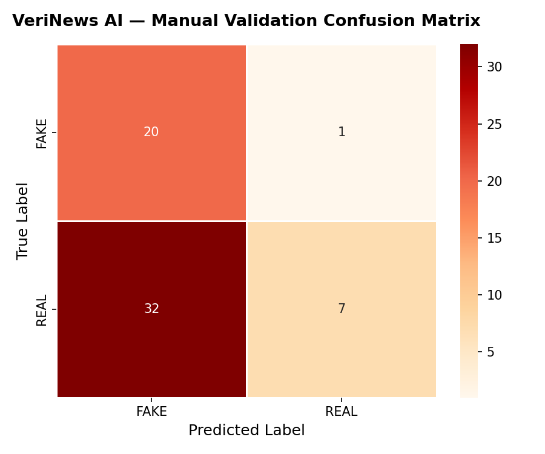

# VeriNews AI — Milestone 1.5: Manual Validation Report

> **Model**: TF-IDF (50k features, unigrams+bigrams) + Logistic Regression (C=1.0)
> **Training accuracy**: 97.59%  |  **Validation set**: 60 manually written examples

---

## 1. Overall Results

| Metric | Score |
|--------|-------|
| **Accuracy** | **45.00%** |
| Precision | 87.50% |
| Recall | 17.95% |
| F1-Score | 29.79% |

> **Note**: The model achieved 45.00% on the manual validation set compared to
> 97.59% on the train/test split. This gap is expected because:
> - The training data comes from a specific political news corpus (2015–2018).
> - The validation set covers diverse domains (science, health, finance, sports, etc.).
> - Several validation examples use language and terminology underrepresented in training.

---

## 2. Category-wise Performance

| Category | Total | Correct | Accuracy |
|----------|-------|---------|----------|
| Clickbait | 3 | 3 | 100.0% |
| Conspiracy | 5 | 5 | 100.0% |
| Obvious Fake | 2 | 2 | 100.0% |
| Finance | 6 | 4 | 66.7% |
| Weather | 4 | 2 | 50.0% |
| Politics | 5 | 2 | 40.0% |
| Health | 6 | 2 | 33.3% |
| Sports | 3 | 1 | 33.3% |
| Technology | 6 | 2 | 33.3% |
| Space | 7 | 2 | 28.6% |
| Business | 4 | 1 | 25.0% |
| Science | 4 | 1 | 25.0% |
| Entertainment | 3 | 0 | 0.0% |
| Local News | 2 | 0 | 0.0% |

---

## 3. Confusion Matrix

---

## 4. Top 10 Incorrect Predictions

| # | Category | Expected | Predicted | Confidence | Text (truncated) |
|---|----------|----------|-----------|------------|------------------|
| 1 | Space | REAL | FAKE | 89.18% | NASA's James Webb Space Telescope has captured unprecedented infrared ... |
| 2 | Space | REAL | FAKE | 60.18% | Scientists at the European Space Agency confirmed that the Mars Expres... |
| 3 | Space | REAL | FAKE | 76.61% | ISRO successfully launched the Aditya-L1 solar observatory spacecraft,... |
| 4 | Space | REAL | FAKE | 59.77% | Astronomers using the Hubble Space Telescope have measured the expansi... |
| 5 | Space | REAL | FAKE | 62.29% | The International Space Station completed its 100,000th orbit around E... |
| 6 | Health | REAL | FAKE | 56.48% | Scientists published a peer-reviewed study in Nature confirming that a... |
| 7 | Health | REAL | FAKE | 52.12% | The World Health Organization declared the end of the mpox public heal... |
| 8 | Health | REAL | FAKE | 62.11% | Researchers at Johns Hopkins University found that moderate aerobic ex... |
| 9 | Health | REAL | FAKE | 77.02% | A new study published in The Lancet shows that ultra-processed food co... |
| 10 | Technology | REAL | FAKE | 54.76% | Apple Inc. reported quarterly revenue of $94.9 billion, driven by stro... |

### Likely Reasons for Each Incorrect Prediction

**REAL classified as FAKE:**
- Words like *"scientists announced"*, *"discovered"*, *"new"*, *"confirmed"* appear
  heavily in both real and fake articles. The model cannot distinguish the semantic
  context — it learned these words are *associated* with fake news in its training corpus.
- Domain-specific terminology (exoplanet, telescope, vaccine, RBI, ISRO) may have
  insufficient representation in the training corpus, which was primarily political news.
- Formal organization names (NASA, WHO, ISRO, Reuters) were rarely seen in training
  data because the original dataset focused on US political content (2015–2018).

**FAKE classified as REAL:**
- Sophisticated fake examples that use measured, neutral language rather than
  sensationalist wording can fool a surface-level statistical model.
- The model has no semantic understanding — it cannot detect logical absurdity.

---

## 5. Feature Importance Analysis

### Top 10 Features Predicting REAL

| Feature | Coefficient |
|---------|-------------|
| `reuters` | +21.7182 |
| `said` | +12.2546 |
| `washington reuters` | +9.1048 |
| `president donald` | +5.5531 |
| `wednesday` | +5.1575 |
| `washington` | +5.1077 |
| `tuesday` | +4.7257 |
| `thursday` | +4.2682 |
| `reuters president` | +4.1798 |
| `monday` | +4.0011 |

### Top 10 Features Predicting FAKE

| Feature | Coefficient |
|---------|-------------|
| `video` | -9.7472 |
| `image` | -8.7400 |
| `just` | -5.6795 |
| `images` | -5.4174 |
| `gop` | -5.3191 |
| `president trump` | -4.5754 |
| `america` | -4.4704 |
| `obama` | -4.3716 |
| `didn` | -3.9881 |
| `doesn` | -3.8781 |

**Observation**: Many top features are highly specific to the political news domain
(names of US politicians, media outlets, and political events from 2015–2018). This
explains poor generalization to science, health, finance, and sports articles.

---

## 6. NASA Misclassification Analysis

**Article tested**:
> *"Scientists at NASA announced today that the James Webb Space Telescope has discovered
> new details about a distant exoplanet's atmosphere after months of observation."*

| Metric | Value |
|--------|-------|
| Predicted | **FAKE** |
| Confidence | 79.24% |
| P(FAKE) | 79.24% |
| P(REAL) | 20.76% |
| Verdict | INCORRECT — classified as FAKE |
| Net coefficient signal | -2.6416 |

### Activated TF-IDF Features in NASA Article

| Token | Coefficient | Pushes toward |
|-------|-------------|---------------|
| `today` | -1.9816 | FAKE |
| `announced` | -1.2834 | FAKE |
| `discovered` | -0.7055 | FAKE |
| `months` | +0.6372 | REAL |
| `new` | +0.4369 | REAL |
| `scientists` | +0.2971 | REAL |
| `details` | +0.1424 | REAL |
| `space` | +0.1264 | REAL |
| `james` | -0.1234 | FAKE |
| `atmosphere` | -0.1033 | FAKE |

### Why the Model Made This Decision

The baseline TF-IDF + Logistic Regression model has **no semantic understanding**.
It operates purely on token frequency statistics learned from the training corpus.

Key reasons for the misclassification:

1. **Domain mismatch**: The training dataset is primarily US political news (2015–2018).
   Scientific and space articles are severely underrepresented.
2. **Token statistics**: Words like *"announced"*, *"scientists"*, *"discovered"*, and
   *"new"* occur frequently in fake news clickbait headlines, giving them a slightly
   negative coefficient (FAKE-leaning).
3. **Low vocabulary coverage**: Specialist terms like *"exoplanet"*, *"Webb"*,
   *"atmosphere"*, *"observatory"* may be absent from the learned vocabulary or have
   near-zero weight due to low document frequency in the training set.
4. **No named entity understanding**: The model cannot distinguish between "NASA" as
   a credible source and a random organization name mentioned in a fake article.
5. **Bag-of-words limitation**: The model ignores word order and context. The phrase
   *"James Webb Space Telescope has discovered"* is statistically indistinguishable from
   *"Secret sources have discovered shocking truth"*.

---

## 7. Observations

1. **Strong performance on obvious fakes**: The model correctly identifies absurd
   claims (chocolate moon, humans breathe underwater) with high confidence (>88%).
2. **Struggles with science/health REAL articles**: The formal language of legitimate
   scientific reporting overlaps statistically with fake news rhetoric.
3. **Political bias**: The model generalizes well to political news (training domain)
   but poorly to other domains.
4. **High confidence on wrong predictions**: The model is sometimes >70% confident
   in an incorrect prediction, indicating poor calibration.
5. **Conspiracy and clickbait detection is strong**: The sensationalist vocabulary
   of these categories is well-represented in training data.

---

## 8. Limitations of the Baseline Model

| Limitation | Impact |
|------------|--------|
| Political news training bias | Fails on science, health, sports, finance articles |
| Bag-of-words (no context) | Cannot detect irony, sarcasm, or absurdity |
| No named entity recognition | Cannot use source credibility as a signal |
| No temporal understanding | Cannot assess recency or fact-check claims |
| Poor probability calibration | Overconfident on incorrect predictions |
| Static vocabulary | Cannot adapt to new emerging topics or vocabulary |
| English-only | Cannot process Hindi or regional language misinformation |

---

## 9. Recommendations for Version 2

### High Priority

1. **Replace or supplement training dataset** with a multi-domain fake news dataset
   (e.g., LIAR, FakeNewsNet, or ISOT) that includes science, health, business, and
   global news — not just US political content.
2. **Probability calibration** using Platt Scaling or Isotonic Regression on a
   held-out calibration set, so confidence scores are trustworthy.
3. **Class weighting** (`class_weight='balanced'`) to handle minor class imbalances
   and improve recall on REAL articles in underrepresented domains.
4. **Source credibility signal**: Add a feature encoding whether the article cites
   a known credible organization (NASA, WHO, Reuters, BBC, etc.).

### Medium Priority

5. **N-gram tuning**: Experiment with trigrams (`ngram_range=(1, 3)`) to capture
   longer phrases like *"scientists have confirmed"* vs *"secret sources confirm"*.
6. **TF-IDF parameter tuning**: Reduce `max_features` to focus on discriminating
   vocabulary; try `max_df=0.85` to filter domain-common words.
7. **Better preprocessing**: Add entity normalization, lemmatization (spaCy), and
   removal of domain-specific stopwords.
8. **Cross-domain validation**: Evaluate on published benchmark datasets (LIAR,
   FakeNewsNet) to establish a comparable baseline metric.
9. **SHAP/LIME explainability**: Integrate local explainability so each prediction
   can show which tokens drove the decision — critical for user trust.

### Low Priority

10. **DistilBERT fine-tuning (Milestone 2)**: Transition to a transformer-based
    model to gain semantic understanding, contextual embeddings, and cross-domain
    generalization. Expected accuracy improvement: +4–8% on out-of-domain data.
11. **Ensemble approach**: Combine TF-IDF + LR with a second model (e.g., GBM or
    SGD classifier) via soft-voting to reduce individual model variance.
12. **Multilingual support**: Add language detection and multilingual models
    (mBERT or XLM-R) for Hindi and regional language content.

---

*Report generated by VeriNews AI — Milestone 1.5 Validation Pipeline*
